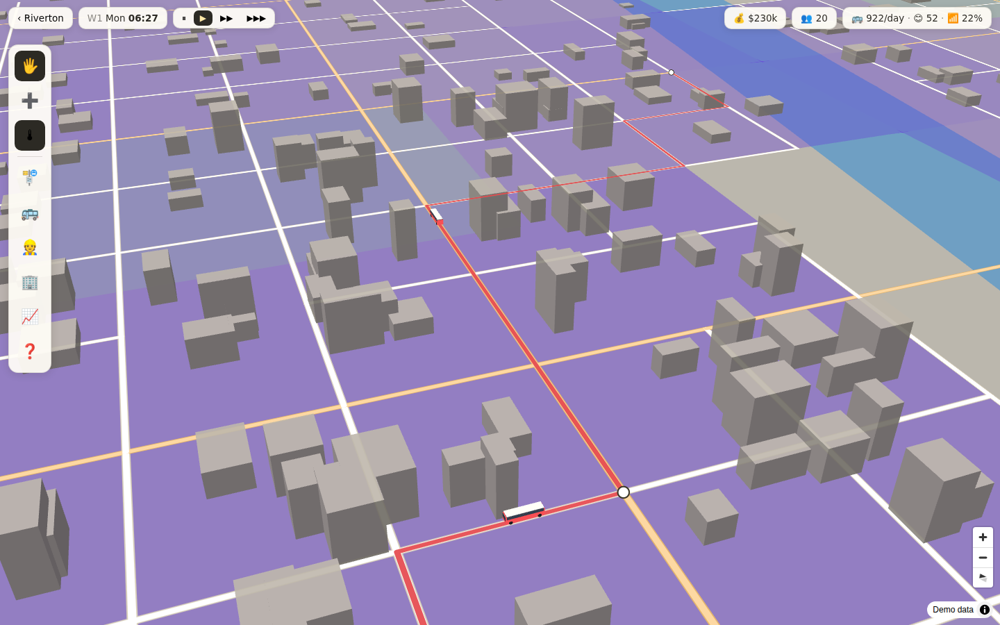
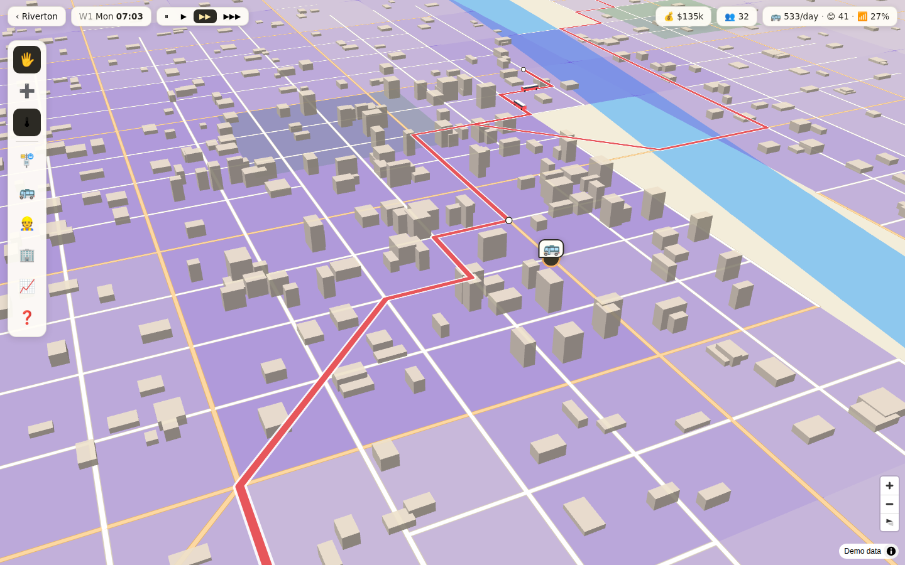

# 🚌 Intralines Bus Simulator

A bus company management game in the spirit of **City Bus Manager**, with the map feel and
real-data simulation of **Subway Builder**: a colorful pan/tilt/rotate map of a real US city,
3D-extruded buildings, census-driven ridership — and low-poly 3D buses you can watch drive
every route.



## Play

**As a desktop app** (its own window, no browser):

```bash
npm install
npm run app
```

To make a double-clickable installer (DMG on Mac, one-click installer on Windows,
AppImage on Linux):

```bash
npm run dist       # output lands in release/
```

The installer is unsigned, so macOS Gatekeeper will warn on first launch — right-click the
app → Open. After installing, the game lives in your Applications/Start Menu like any other
app and no terminal is needed again.

**Or in the browser:**

```bash
npm install
npm run dev        # open http://localhost:5173
```

- **Riverton (demo city)** is bundled — instant play, fully offline, great for learning the game.
- **Worcester MA, Des Moines IA, Madison WI** are real cities. On first launch your browser
  downloads the data live (≈10–40 MB, **one time** — it's cached locally and every later
  session plays offline):
  - block group boundaries — US Census **TIGERweb**
  - population per block group — Census **ACS 5-year**
  - jobs per block group — Census **LEHD LODES** (falls back to an estimate if the download
    is blocked; the attribution line tells you which you got)
  - streets, lakes, rivers and parks — **OpenStreetMap** via Overpass

## Offline play

After the one-time data download the game **does not need the internet**. Real cities render
with a built-in basemap drawn from the cached data itself: real streets, water and parks from
OpenStreetMap, plus stylized 3D buildings generated from census density. If you're online,
the game can instead use live OpenFreeMap tiles (real building footprints, street labels) —
the 🌐/🗺 button in the toolbar switches between *auto (online when reachable)* and
*always offline*; when tiles can't be reached the game falls back to the offline map
automatically.

To skip the in-browser download entirely, pre-bake city packs on any machine with open
internet and commit/serve the result:

```bash
npm run bake -- worcester        # or: desmoines madison all
```

This writes `public/cities/<id>.json.gz`; the game uses a baked pack automatically when
present — first launch is then instant and fully offline.

## How to play

1. **🏗 Place your depot** near a road — every bus lives there. (Simplified on purpose: one
   depot with upgrade levels and three add-ons — workshop, wash bay, chargers. No restroom
   micromanagement.)
2. **🚌 Buy buses** (Fleet panel) and **👷 hire drivers** — one per bus on the road — plus
   mechanics to keep running costs down.
3. **➕ Draw a line**: click stops along streets; the route snaps to the road network via A*.
   Use the **🌡 heatmap** (purple = residents, teal = jobs) to connect where people live with
   where they work.
4. **Tune each line**: frequency, service hours, fare, bus model, vehicle count.
5. Tilt the map (right-drag) and watch your buses run. Fast-forward with ▶▶▶, and expand —
   bigger buses unlock as total riders served grows.

**Keys:** `space` pause · `1/2/3` game speed · `esc` cancel/close.

## How ridership works

The same idea as Subway Builder, scaled to buses:

- Every census block group holds **residents** and **jobs** from real census data.
- Commuters are generated home→work with a **distance-decay gravity model** calibrated per city.
- For each origin–destination flow the sim computes door-to-door **bus time** (walk to stop at
  12 min/km within a 650 m catchment + wait from your actual headway + in-vehicle time +
  transfers with penalty) and compares it against **driving** (with a parking penalty) and
  **walking** in a logit mode-choice, plus a captive-rider share with no car access.
- Riders follow the day's rush-hour profile; overcrowded lines turn riders away; each boarding
  pays your fare **plus a city subsidy per rider** (like real US transit contracts).
- Costs: driver wages while buses run, per-km running costs by bus model, mechanics, depot
  upkeep. The whole model runs in a Web Worker and recomputes whenever your network changes.



## Project layout

```
scripts/
  make-demo-city.mjs    procedural Riverton generator (deterministic)
  bake-city.mjs         Node pipeline: census + OSM -> public/cities/<id>.json
electron/
  main.cjs              desktop shell: serves dist/ over app:// in an Electron window
src/
  game/
    types.ts            CityPack + player-state types
    constants.ts        all balance/tuning knobs in one place
    store.ts            zustand store: clock, economy, editor, save/load
    routing.ts          road graph, A*, point-along-path
    sim/demand.worker.ts gravity model + mode choice + line stats (Web Worker)
    data/               city registry, browser data loaders, IndexedDB cache,
                        pipeline.js (shared browser/Node transforms)
  map/
    basemapStyle.ts     colorful OpenFreeMap style + offline demo style
    overlays.ts         heatmap / lines / stops / draft / depot layers
    busLayer3d.ts       Three.js custom layer: animated 3D buses
    MapView.tsx         map lifecycle + interactions + day/night tint
  ui/                   top bar, toolbar, panels, menu, loading screen
```

## Tests

```bash
npm test        # fixture tests for the data pipeline (way splitting, ring
                # stitching, census parsers) — no network needed
```

## Known limitations / roadmap ideas

- Transfers are modeled through one shared stop between two lines (no full journey planner).
- Buses ignore one-way streets and traffic; travel time comes from per-model speeds.
- LODES jobs download depends on the LEHD server allowing browser requests; otherwise jobs are
  estimated (clearly labeled) — baking with `npm run bake` always uses real LODES data.
- Offline-mode buildings are stylized (density-driven), not real footprints — switch the
  basemap to online for real building shapes.
- Saves live in `localStorage` (export/import available in the Finances panel).
- Fun next steps: POI demand spikes (stadiums, campus events), line-profit overlays, walk-shed
  isochrone preview, more cities (any US metro works — add an entry to `cities.ts` and bake).

## Data & attribution

US Census Bureau (ACS, LEHD LODES, TIGERweb) · OpenStreetMap contributors ·
OpenFreeMap / OpenMapTiles tiles. This is a game; simulation numbers are illustrative,
not transit planning advice.
