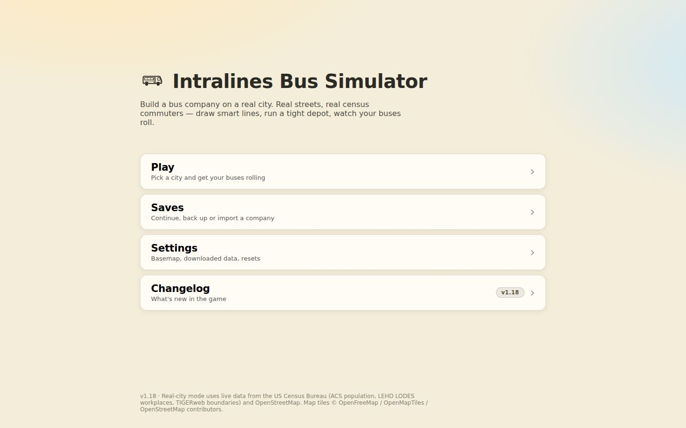
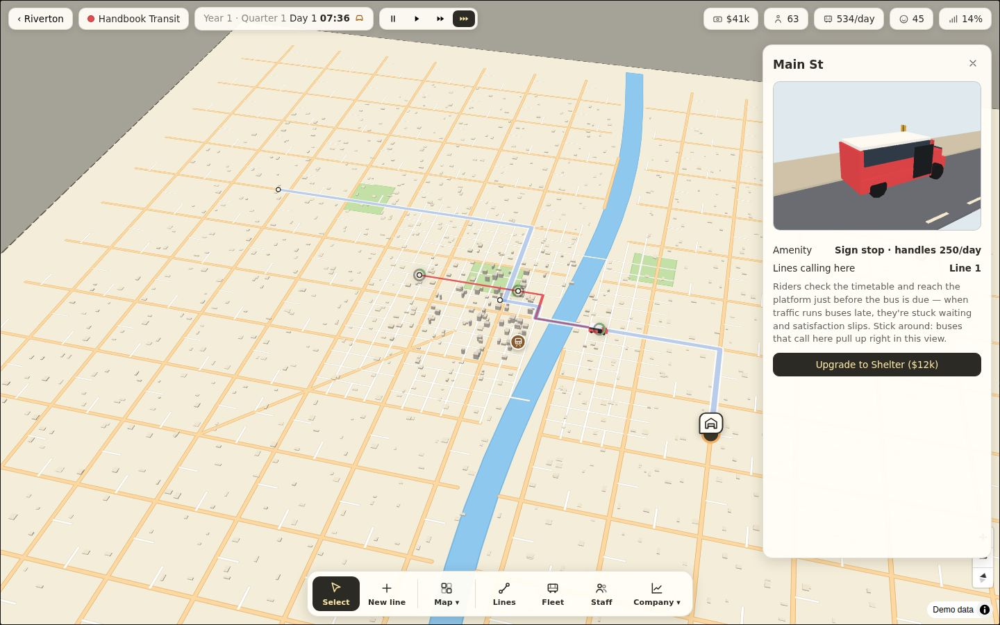
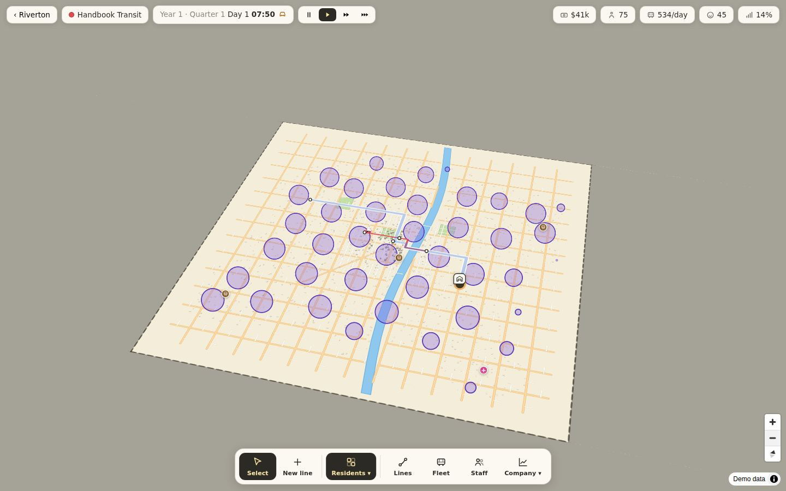
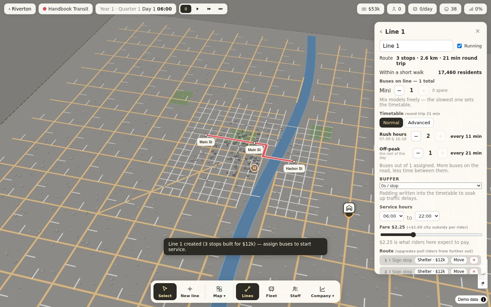
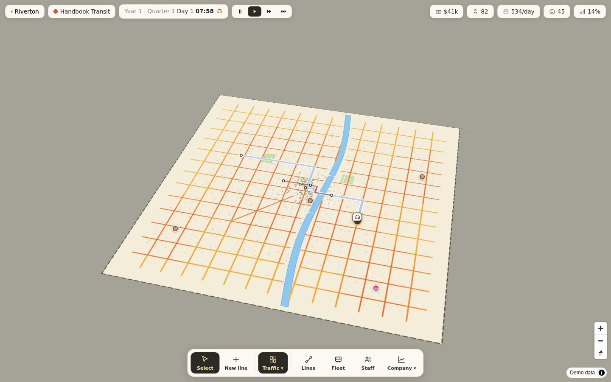
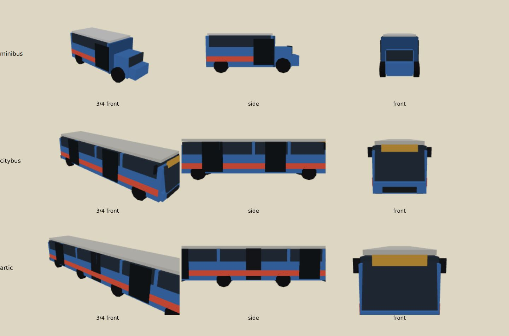

# Intralines — Mechanics & Feel

*A design overview: what the game is, how it plays, and the feel it aims
for. The companion reference — every screen, formula and constant — lives in
[MANUAL.md](MANUAL.md).*

---

## 1. The premise

You run a small bus company in a real American city. The streets are real,
the commuters come from real census data, and none of them owe you anything:
every single rider compares your bus against their car, door to door, and
picks whichever is less trouble. Your job is to be less trouble — then to
turn that into a company.

## 2. The feel

Three ideas govern how Intralines looks and behaves:

**A warm paper world.** The whole game lives in one material palette — cream
paper, dark ink, a bus-blind amber — like a transit map folded into your
pocket. One hand-drawn bus appears everywhere from the browser tab to the
loading screen, where it starts its engine, shudders, puffs exhaust, and tows
the loading screen away. No emoji, no browser popups, no stock UI: even the
error messages and confirm dialogs are in-world.

**A living miniature.** The city is watchable for its own sake. Buses
accelerate, brake, crawl in rush-hour traffic, switch their headlights on at
dusk, pull out of the depot in the morning and come home to refuel. Little
passengers walk to their stops, visibly wait, and board when a bus actually
arrives. Click any stop and you get a 3D diorama of that exact stop — its
real tier of furniture, a crowd matching the live queue, and your bus
sliding its painted door open. The map tints with the time of day.

**Visible cause and effect.** Nothing important happens only in a
spreadsheet. Congestion is a color on the roads; crowding is people spilling
off a curb; a driver shortage is buses parked; your success is car-grey dots
turning bus-green on the travel-modes layer. The rules draw themselves too:
depot zoning *is* the green tint, express status names its own thresholds,
and both timetable modes show their arithmetic as you drag.

## 3. The core loop

1. **Read the city.** Two demand layers — where trips *start* (residents)
   and where they *end* (jobs, campuses, hotels, the airport, the rail
   station). Up close they're a fine scatter you can read street by street;
   zoomed out they merge into calm blobs.
2. **Connect the two.** Draw a line along real streets; every click is a
   stop, the route snaps to the road network, and a live preview counts the
   people within a short walk.
3. **Resource it.** A depot on industrial land, buses from a five-model
   catalog, one driver per bus, mechanics to keep the fleet healthy.
4. **Set the service.** Frequency (by bus count or by promised wait), hours,
   fare, stop quality.
5. **Watch the money — and the city's opinion.** Riders appear at the rate
   the model says they should; the Transit Authority grades you quarterly;
   profit funds the next line.

## 4. The systems, in broad strokes

**Demand is simulated people, not spawned riders.** Residents commute
out-and-back on a gravity model; visitors are different animals who hop
sight-to-sight on their own hours and drift to hotels and the airport.
Everyone weighs walk + wait + ride + transfer against the car (with its
parking pain), and a slice of the city has no car at all. Fares count as
time: undercut the going rate and you pull people out of cars, gouge and
they quietly leave.

**Service quality is physics, not a slider.** A line's round trip comes from
real distance, the slowest bus you assigned, dwell at each stop, and
traffic. Frequency is buses ÷ round trip — promise more than your fleet can
run and the schedule visibly stretches. Riders time their arrival to your
timetable, so *lateness*, not headway, is what makes them fume; padding the
schedule trades speed for punctuality.

**Money is a running ledger.** Fares plus a city subsidy per boarding in;
fuel, maintenance, wages, upkeep and overhead out — continuously, not at
turn boundaries. Growth is gated by ridership milestones (bigger buses
unlock as your total riders served climbs) and by escalating land prices.
Two lenders bracket the risk curve: a predatory one that always says yes,
and a reputable one that reads your credit score first.

**The city grades you.** Every 10-day quarter, a report card across seven
dimensions — coverage, connectivity, passenger and staff happiness, safety,
reliability, environment — pays a grant or levies a fine. It's the game's
long-term rudder: profit says how you're doing this week, the report says
whether you're building a network the city respects.

**Buses age, streets clog, success feeds back.** Wear raises costs and drags
safety until you refurbish. Rush hour genuinely slows your fleet (backed by
real traffic counts where the city publishes them) — but every rider you win
is a car removed, and busy corridors visibly ease. Express lines — long,
sparse-stopped — earn faster-feeling rides, fare tolerance, and a fatter
subsidy.

## 5. What pushes back

There's no antagonist; the friction is structural. Cash is tight from the
first minute (the starting budget covers exactly one honest line). Every
improvement has a running cost attached, so overbuilding bleeds. The best
corridors crowd; crowded buses shed riders; the fix costs money you were
saving for the next line. Rush hour punishes the network right when it earns
the most. And the report card judges dimensions that pure profit-chasing
neglects — coverage of quiet neighbourhoods, staff you'd rather not pay,
buses you'd rather not fix.

## 6. The arc of a company

**The first hour** is intimacy with one line: found the company, find the
industrial park, connect homes to downtown, hire a driver, press play, and
watch your one Sparrow minibus do laps while the ledger ticks.

**The middle game** is a network: transfers start to matter, hubs earn their
keep, the fleet mixes models per line, timetables split by time of day, and
the credit score opens the good bank.

**The late game** is optimization at scale: express corridors, electric
fleets under depot chargers, five depots feeding thirty buses, and the
travel-modes layer as your scoreboard — how much of this city did you
actually change?

**Sandbox mode** removes the money and keeps everything else, for players
who want the miniature without the ledger.

## 7. Tone

The writing is a friendly operator's voice — concrete, lightly wry, never
corporate. The predatory bank "knows it's the only lender left in town";
paying it off gets you "a tasteful thank-you card"; zoning refusals tell you
to "think the industrial park or out by the airport." Warnings explain
consequences, not codes. The game assumes you're smart and busy: every rule
that could be a hidden formula is instead said out loud, in place, at the
moment it matters.

## 8. The pillars, briefly

1. **Real data, honest simulation** — the city's shape is the level design.
2. **Watchable at every zoom** — from a city-wide scatter to one door
   opening.
3. **Rules you can see** — the map draws the constraint; the panel does the
   arithmetic.
4. **Failure is recoverable** — saves survive updates, errors explain
   themselves, and nothing the player built is ever silently lost.
